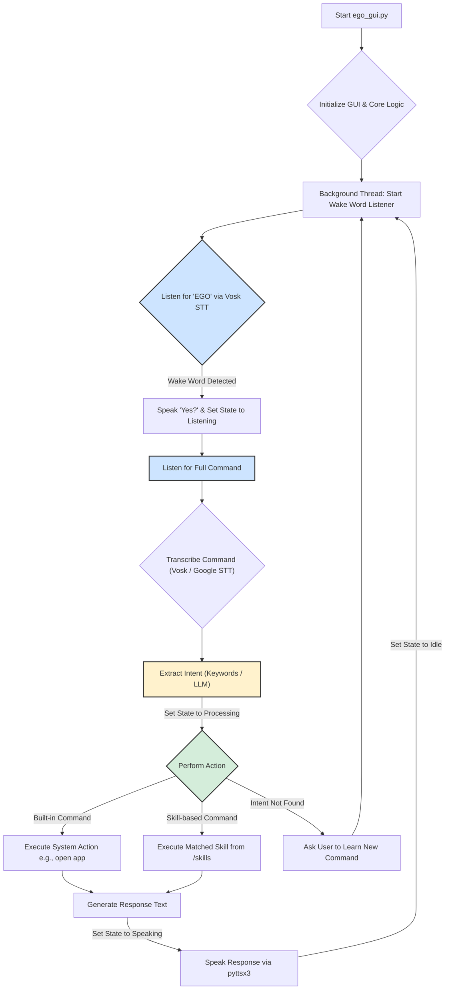

# EGO - Your Personal AI Assistant

EGO is a personal AI assistant with a visually appealing interface and a modular skill system. It listens for the wake word "EGO" and can perform a variety of tasks based on your voice commands.

## How It Works

The application follows a clear, state-driven workflow from listening to responding.

1.  **Initialization**: Running `ego_gui.py` launches the Tkinter GUI and starts a background thread for the core logic (`wake_word_listener`). The Text-to-Speech (TTS) engine and all available skills in the `/skills` directory are loaded.

2.  **Wake Word Detection**: The system continuously listens for the wake word "EGO" using the offline **Vosk** speech recognition engine. During this phase, the GUI orb is in an `idle` state.

3.  **Command Listening**: Once "EGO" is detected, the assistant audibly responds "Yes?" and transitions the GUI orb to a `listening` state. It is now ready to accept a full command.

4.  **Speech-to-Text (STT)**: The user's command is captured from the microphone. The system prioritizes the offline **Vosk** engine for transcription. If Vosk fails or is unavailable, it falls back to the online **Google Speech Recognition** API.

5.  **Intent Extraction**: The transcribed text is processed to determine the user's intent:
    *   It first checks for a match in `learned_commands.json`, a file containing custom commands taught by the user.
    *   If no custom command is found, it performs simple keyword matching for core skills (e.g., "weather", "news").
    *   As a final fallback, it uses a local **GPT-2** model to analyze the text and extract a general intent (e.g., for "Open Spotify", the intent is `open_app` and the target is `Spotify`). The orb enters a `processing` state.

6.  **Action & Skill Execution**: The extracted intent is used to perform an action:
    *   It first checks for built-in system commands like opening an application, performing a web search, or taking a screenshot.
    *   If the intent does not match a built-in command, the system iterates through the loaded skills from the `/skills` directory and executes the `run` function of the skill designed to handle that intent.

7.  **Response (TTS)**: The result or confirmation from the skill is converted into speech using the **pyttsx3** library. The orb changes to a `speaking` state while the audio is played. Afterwards, it returns to the `idle` state, ready for the next wake word.

## Architecture Flowchart

The following diagram illustrates the control flow of the EGO assistant.



## Features

*   **Voice Activated:** Listens for the "EGO" wake word.
*   **GUI:** A modern, animated interface with a dynamic orb that indicates the assistant's status (idle, listening, speaking, processing).
*   **Modular Skill System:** Easily extendable with new skills.
*   **Natural Language Understanding:** Uses a local LLM (GPT-2) to understand your commands.
*   **Offline Speech Recognition:** Can use the Vosk engine for offline speech recognition.
*   **Command Learning:** Can learn new commands and associate them with actions.

## What it can do

EGO can perform a variety of tasks, including:

*   **Telling Jokes:** "EGO, tell me a joke."
*   **Getting News:** "EGO, what's the latest news?"
*   **Opening Websites:** "EGO, open YouTube."
*   **Getting System Information:** "EGO, what's the CPU usage?"
*   **Fetching Weather:** "EGO, what's the weather like in London?"
*   **Searching Wikipedia:** "EGO, who is Albert Einstein?"
*   **Taking Screenshots:** "EGO, take a screenshot."
*   **Getting the Time:** "EGO, what time is it?"
*   **And more!** You can teach EGO new commands.

## How to Start

1.  **Clone the repository:**
    ```bash
    git clone <repository-url>
    cd <repository-folder>
    ```

2.  **Install the dependencies:**
    ```bash
    pip install -r requirements.txt
    ```

3.  **Download the Vosk model:**
    *   Download a Vosk model from [https://alphacephei.com/vosk/models](https://alphacephei.com/vosk/models).
    *   Extract the model and place it in a folder named `model` in the root of the project.

4.  **Run the application:**
    ```bash
    python ego_gui.py
    ```

## Dependencies

The project uses the following libraries:

*   `requests`
*   `wikipedia`
*   `speechrecognition`
*   `pyttsx3`
*   `pillow`
*   `torch`
*   `transformers`
*   `accelerate`
*   `vosk`
*   `sounddevice`
*   `psutil`
*   `newsapi-python`
*   `pyautogui`
*   `tkinter`

